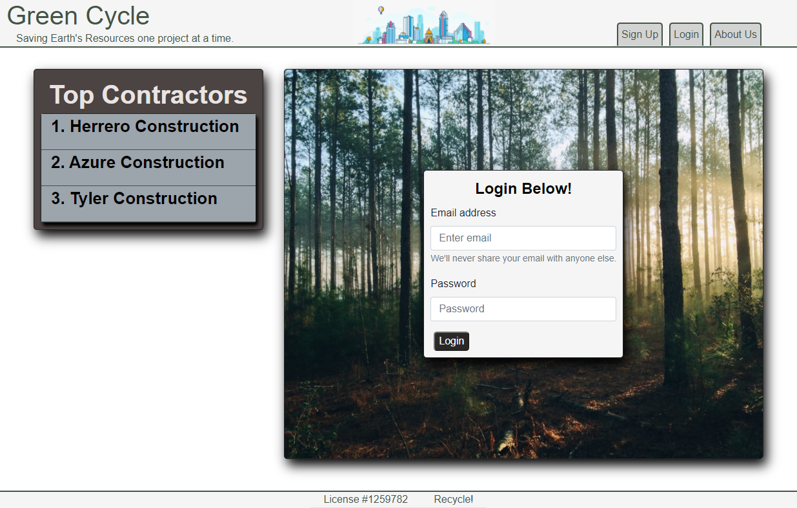

# Green-Cycle

## Description
The U.S. alone contributions an esteemed 251 Million tons of consumer waste annually, but less than a third is recycled or composted. As much as 40% of this waste comes from Construction Projects, which produce a surplus of unused building materials. This is where the Green Cycle application comes into play - to track all the unused building material waste - either through demo or new Construction. We want to tap into that market & make it a priority for these Contractors to recycle by making it a competition. With the World moving more and more towards Green Energy and Recycling Tactics, we believe now is an opportune time to start tracking waste & making sure it’s recycled.

## Table Of Contents

- [Description](#description)
- [User Story](#user-story)
- [Installation](#installation)
- [Languages & Technologies Used](#languages-and-technologies-used)
- [Contributing](#contributing)
- [Tests](#tests)
- [License and Copyright](#license-and-copyright)

## User Story

When a user opens the website 
then will be a section that shows top recycling GC and will also be the login page.
When a user clicks on the Info Button
Then the user will be directed to Information about the Website.
When a user selects the Sign-Up button
Then they are directed to a Sign-Up Page
When a User enters their information and clicks submit
Then a new Object is created in the database with the specified GC’s Information
When a user Logs In
Then the user will be directed to a Dashboard Page showing all Specific Projects & All Recycling Metrics for Concrete, Steel, and Wood Materials
When a user selects the Add Project Button
Then a Modal pops up that allows a User to add a new Project
When a user select a specific project
Then a user will see that Specific Project with all 5 of the last submitted Items, an element with Metrics of Recycling Items.
When a user selects + Add Recycle Item
Then a Modal pops up that allows the User to enter in new Recycle Item
When a user selects +View More Recycle Items 
Then  a user is taken to a page that shows all the Recycled Items under that material for that specific project.

## Installation

To launch the application, please click [here](https://mighty-headland-87510.herokuapp.com/) to view the application the the deployed Heroku site, sign in or log in to create your account, and begin documenting your Recycling amounts!

## Languages and Technologies Used

This application used React JSX, Mongoose, Express, React-Bootstrap, React-chart.js, graphql, JW tokens

## Contributing

- Scotty Yackzan: <syackzan@gmail.com>

## Tests

N/A

## License and copyright

(c) Scotty Yackzan

Licensed udner the MIT License

